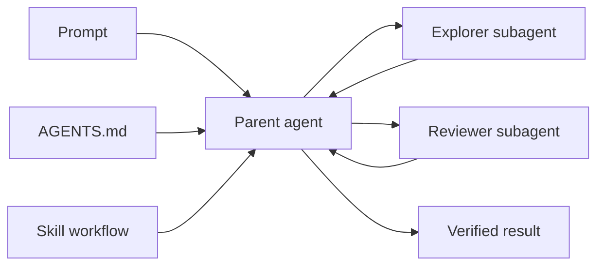

# Codex Project Organizer

**English** · [Русский](README.ru.md)

> An audit skill that turns a folder of code into a clear Codex workspace—without duplicated rules, lost context, or accidentally published private notes.

[](LICENSE)
[](https://www.python.org/)
[](https://learn.chatgpt.com/docs/build-skills)

The goal is not to create more configuration. The goal is context recovery: a fresh session should quickly understand the project boundary, mandatory rules, current phase, next action, and available capabilities.



## What's included

- `SKILL.md` — the audit and organization workflow.
- `scripts/inspect_codex_project.py` — a read-only inspector for instruction discovery, Git boundaries, skills, MCP, hooks, memories, and custom agents.
- `references/architecture.md` — the ownership matrix and common workspace shapes.
- `examples/multi-agent/` — a minimal parent→subagents setup with explorer and reviewer roles.
- `tests/` — dependency-free tests for the inspector.

## Quick start

### 1. Install as a user skill

Codex discovers user skills under `~/.agents/skills`. Clone this repository there:

```bash
git clone https://github.com/GleckusZeroFive/codex-project-organizer.git ~/.agents/skills/organize-codex-project
```

PowerShell:

```powershell
git clone https://github.com/GleckusZeroFive/codex-project-organizer.git "$HOME\.agents\skills\organize-codex-project"
```

Invoke the skill explicitly:

```text
$organize-codex-project audit this workspace and propose the minimum structure required for reliable cold-start sessions
```

Codex can also select the skill automatically when a request matches its `description`.

### 2. Run the inspector directly

```powershell
python scripts\inspect_codex_project.py --cwd D:\path\to\workspace
```

```bash
python3 scripts/inspect_codex_project.py --cwd /path/to/workspace
```

Use `--json` for machine-readable output. Add `--strict` when warnings should produce exit code `1`, for example in CI.

The inspector does not print credential values. It reports structure and the names of registered capabilities.

## Parent → subagents

A parent/child setup has three layers:

1. The parent receives durable project guidance from `AGENTS.md` and reusable workflow instructions from the skill.
2. `.codex/agents/*.toml` defines narrow custom-agent roles.
3. The parent delegates independent tasks and integrates compact results into the main thread.

A model-neutral template is available in [`examples/multi-agent`](examples/multi-agent). The roles can inherit the parent's settings or pin a model locally when there is a stable reason to do so.

```text
project/
├── AGENTS.md
└── .codex/
    ├── config.toml
    └── agents/
        ├── explorer.toml
        └── reviewer.toml
```

Parallelism works best for independent reading, research, and review. Several agents editing the same files at once usually create more conflicts than speed.

## Context ownership model

| Information | Canonical location |
|---|---|
| One-off constraint | Current prompt/thread |
| Personal rules for every project | `~/.codex/AGENTS.md` |
| Stable repository rules | Root or nested `AGENTS.md` |
| Phase, blockers, NEXT, authorization | One LIVE STATE file or section |
| Repeatable procedure | Skill |
| Child-agent role | `~/.codex/agents/*.toml` or `.codex/agents/*.toml` |
| External system | MCP/connector |
| Mechanical protection | Hook, CI, linter |
| Recall from previous sessions | Memories as a recall layer, never the canon |

The core principle is simple: one mutable fact has one canonical owner. Other files may route to it, but should not contain drifting copies.

## Common use cases

- Prepare a new repository for Codex.
- Reduce an oversized `AGENTS.md` or resolve conflicts with `CLAUDE.md` and other entrypoints.
- Diagnose a missing global skill, MCP server, or hook.
- Preserve phase and `NEXT` across compaction and fresh sessions.
- Keep a private client wrapper outside the client's Git repository.
- Add custom agents and make parent/child inheritance explicit.

## Verification

```bash
python -m unittest discover -s tests -v
python scripts/inspect_codex_project.py --cwd .
```

Windows, macOS, and Linux are supported with Python 3.11+ and Git.

## Official documentation

- [Custom instructions with AGENTS.md](https://learn.chatgpt.com/docs/agent-configuration/agents-md)
- [Subagents](https://learn.chatgpt.com/docs/agent-configuration/subagents)
- [Build skills](https://learn.chatgpt.com/docs/build-skills)
- [Advanced configuration](https://learn.chatgpt.com/docs/config-file/config-advanced)
- [Hooks](https://learn.chatgpt.com/docs/hooks)
- [Memories](https://learn.chatgpt.com/docs/customization/memories)

## Contributing and license

See [CONTRIBUTING.md](CONTRIBUTING.md). Released under the [MIT License](LICENSE).
