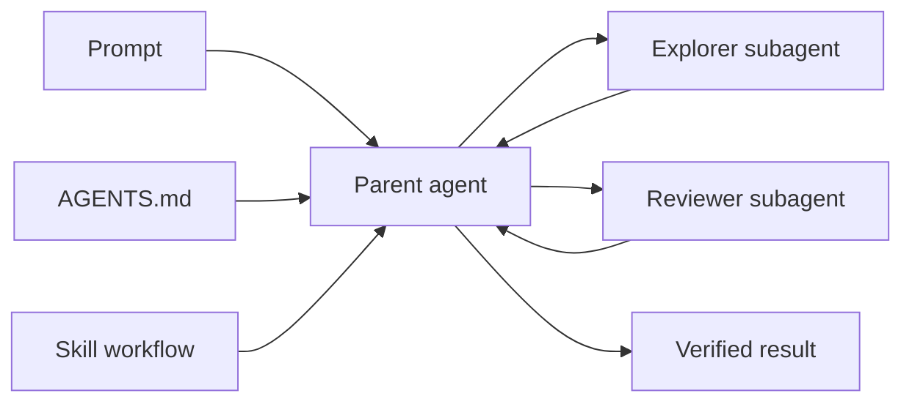

# Codex Project Organizer

> Скилл-аудитор, который помогает превратить папку с кодом в понятное рабочее окружение для Codex — без дублирования правил, потерянного контекста и случайной публикации приватных заметок.

[](LICENSE)
[](https://www.python.org/)
[](https://learn.chatgpt.com/docs/build-skills)

Скилл решает не задачу «создать побольше конфигов», а задачу восстановления контекста: новый сеанс должен быстро понять границы проекта, обязательные правила, текущую фазу, следующий шаг и доступные возможности.



## Что внутри

- `SKILL.md` — основной workflow аудита и организации проекта.
- `scripts/inspect_codex_project.py` — read-only инспектор discovery-цепочки, Git-границ, skills, MCP, hooks, memories и custom agents.
- `references/architecture.md` — матрица владельцев информации и типовые формы проектов.
- `examples/multi-agent/` — минимальный пример parent→subagents с отдельными ролями исследователя и ревьюера.
- `tests/` — тесты инспектора без внешних Python-зависимостей.

## Быстрый старт

### 1. Установить как пользовательский skill

Codex ищет пользовательские skills в `~/.agents/skills`. Клонируйте репозиторий туда:

```bash
git clone https://github.com/GleckusZeroFive/codex-project-organizer.git ~/.agents/skills/organize-codex-project
```

Для PowerShell:

```powershell
git clone https://github.com/GleckusZeroFive/codex-project-organizer.git "$HOME\.agents\skills\organize-codex-project"
```

После установки вызовите скилл явно:

```text
$organize-codex-project проверь этот workspace и предложи минимальную структуру для надёжных cold start сессий
```

Codex также может выбрать скилл автоматически, когда запрос совпадает с его `description`.

### 2. Запустить инспектор напрямую

```powershell
python scripts\inspect_codex_project.py --cwd D:\path\to\workspace
```

```bash
python3 scripts/inspect_codex_project.py --cwd /path/to/workspace
```

Для машинной обработки используйте `--json`; для CI-проверки, где предупреждение должно завершать команду с кодом `1`, добавьте `--strict`.

Инспектор не печатает значения конфигурации и секреты. Он показывает только структуру и имена зарегистрированных возможностей.

## Parent → subagents

Связка «родитель → дочерние агенты» складывается из трёх уровней:

1. Родитель получает устойчивые правила проекта из `AGENTS.md` и workflow из skill.
2. В `.codex/agents/*.toml` описываются узкие роли дочерних агентов.
3. Родитель делегирует им независимые задачи и собирает краткие результаты в основной поток.

Готовый нейтральный шаблон лежит в [`examples/multi-agent`](examples/multi-agent). В нём роли не привязаны к конкретной модели: можно оставить наследование настроек родителя или задать модель локально.

```text
project/
├── AGENTS.md
└── .codex/
    ├── config.toml
    └── agents/
        ├── explorer.toml
        └── reviewer.toml
```

Параллелизм полезен для независимого чтения, исследования и ревью. Несколько агентов, одновременно меняющих одни и те же файлы, чаще создают конфликты, чем ускоряют работу.

## Модель владения контекстом

| Что | Где хранить |
|---|---|
| Разовое ограничение | Текущий prompt/thread |
| Личные правила для всех проектов | `~/.codex/AGENTS.md` |
| Стабильные правила репозитория | Корневой или вложенный `AGENTS.md` |
| Фаза, blockers, NEXT, разрешения | Один LIVE STATE файл/раздел |
| Повторяемая процедура | Skill |
| Роль дочернего агента | `~/.codex/agents/*.toml` или `.codex/agents/*.toml` |
| Внешняя система | MCP/connector |
| Механическая защита | Hook, CI, linter |
| Воспоминания прошлых сессий | Memories как recall-слой, не канон |

Главный принцип: один изменяемый факт — один канонический владелец. Остальные файлы могут ссылаться на него, но не должны содержать расходящиеся копии.

## Типовые случаи

- Новый репозиторий нужно подготовить к работе с Codex.
- `AGENTS.md` разросся или конфликтует с `CLAUDE.md` и другими entrypoints.
- Codex не видит глобальный skill, MCP или hook.
- После compaction или нового сеанса теряется текущая фаза и `NEXT`.
- Приватная обёртка клиента случайно смешивается с клиентским Git-репозиторием.
- Нужно добавить custom agents и понять, что должен наследовать родитель, а что — дочерняя роль.

## Проверка

```bash
python -m unittest discover -s tests -v
python scripts/inspect_codex_project.py --cwd .
```

Поддерживаются Windows, macOS и Linux с Python 3.11+ и установленным Git.

## Официальная документация

- [Custom instructions with AGENTS.md](https://learn.chatgpt.com/docs/agent-configuration/agents-md)
- [Subagents](https://learn.chatgpt.com/docs/agent-configuration/subagents)
- [Build skills](https://learn.chatgpt.com/docs/build-skills)
- [Advanced configuration](https://learn.chatgpt.com/docs/config-file/config-advanced)
- [Hooks](https://learn.chatgpt.com/docs/hooks)
- [Memories](https://learn.chatgpt.com/docs/customization/memories)

## Лицензия

[MIT](LICENSE). Используйте, меняйте и пересылайте.
